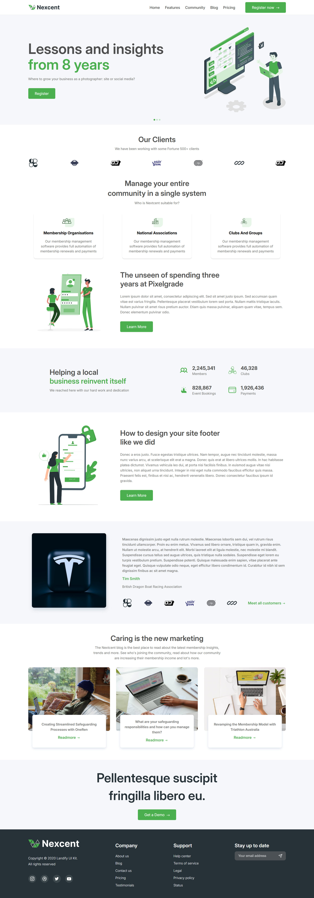

# Minimal Landing Page

This project involves converting a minimal Figma landing page design into a fully responsive website built with **HTML** and **CSS**.

---

## 🌟 Project Overview

This landing page is based on agency-style design that focuses on simplicity, structure, and visual balance. My goal was to practice turning a UI design into real code while maintaining responsiveness across different screen sizes.
The original design is optimized for a desktop layout, but also adapts to tablets and mobile screens.

---

## 🚀 Features

- Fully responsive layout (desktop, tablet, mobile)
- Flexible layout using **Flexbox** / **Grid**
- Structured page using semantic **HTML** elements
- Modern minimal UI based on Figma design

---

## 💡 What I Practiced

- Converting Figma layouts into HTML and CSS
- Building responsive layouts with Flexbox and CSS Grid
- Working with structured HTML and CSS
- Creating consistent page layouts from a design

---

## 🔗 Live Demo

[`View Live Demo`](https://alinamaistrenko.github.io/maistrenko-landing-page/)

---

## 🙏 Credits

Original UI Design: [Muntasir Billah on Figma](https://www.figma.com/community/file/1222060007934600841)

---

## Long Screenshot

Here’s a preview of the full-length layout:

